# Espectroscopía inversa de horizontes acústicos

Identificabilidad del perfil de flujo de un vórtice transónico a partir de su espectro de dispersión superradiante.

Contribución aceptada como póster en el XXV Meeting of Physics 2026, Facultad de Ciencias, Universidad Nacional de Ingeniería.

<p align="center">
  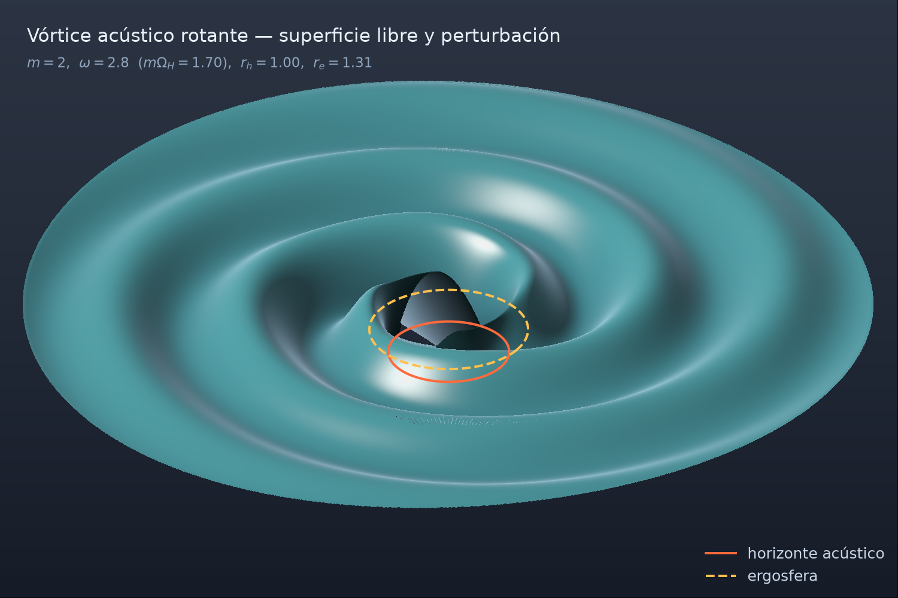
</p>

## De qué va esto

Un vórtice drenante transónico tiene la misma estructura causal que un agujero negro rotante: horizonte acústico, arrastre de marco, dispersión superradiante. Casi toda la literatura resuelve el problema directo, fijas el perfil de flujo y calculas el espectro.

Acá se hace al revés. Dado el espectro de dispersión, cuánta información se puede recuperar sobre el perfil que lo produjo, y qué direcciones del espacio de perfiles quedan invisibles a la medición. En un experimento real se mide el espectro, no la métrica. Si ese mapa no es inyectivo dentro de la resolución del experimento, decir que "se midió la geometría" es afirmar de más.

## El diseño

Fondo: vórtice drenante rotante (draining bathtub).

```
v_r(r) = -(A/r)      v_phi(r) = B/r      r_h = A/c
```

La parte que importa es la familia de perfiles isohorizontales:

```
v_r(r) = -(A/r) [ 1 + h(r) ]      con h(r_h) = 0 y h'(r_h) = 0
```

Esas dos condiciones dejan fijos a la vez el horizonte `r_h` y la gravedad superficial `κ = c²/A`. Así se desacopla κ de la forma del perfil: si el espectro cambia, no puede ser porque cambió la temperatura de Hawking análoga, tiene que ser por la forma en sí. Sin eso el experimento numérico no prueba nada.

Dos familias en `src/physics/deformation.py`:

- `GaussianDeformation(r_h, eps, sigma)`: deformación localizada, decae a cero en el infinito. Es la que se usó para el análisis de Fisher del póster.
- `PolynomialDeformation(r_h, a)`: no decae en el infinito, `h(∞) = Σa_k`. Reescala el drenaje asintótico manteniendo r_h fijo, así que parte de esta deformación se puede medir en el campo lejano sin necesidad de espectroscopía. Hay que tenerlo presente si se usa para el problema inverso.

`Deformation.check_boundary_conditions()` chequea `h(r_h)=0` y `h'(r_h)=0` en cada instancia.

<p align="center">
  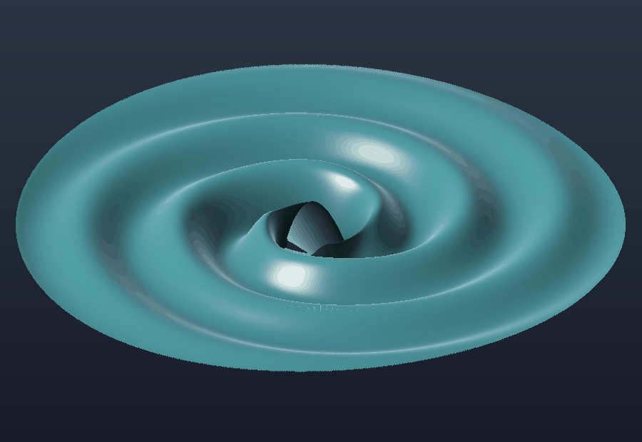
</p>

## Estado

| Componente | Estado |
|---|---|
| Geometría del vórtice (`physics/background.py`) | listo |
| Familia de deformaciones isohorizontales | listo |
| Potencial efectivo, reducción a forma de Schrödinger (`mathematics/potential.py`) | listo, verificado contra la forma cerrada |
| Problema directo, dominio de frecuencia (`numerics/radial.py`) | listo |
| Problema directo, kernel CUDA (`field/cuda_radial.py`, `field/chi2_cuda.py`) | listo, validado contra scipy |
| Campo complejo y visualización (`field/scattering.py`, `field/coloring.py`, `viz/`) | listo |
| Matriz de Fisher, parámetros fraccionarios (`field/fisher.py`) | listo |
| Verosimilitud real vs. Fisher (`experiments/chi2_surface_3d.py`) | listo |
| Búsqueda de QNM (`numerics/qnm.py`) | listo, método de disparo con acople |
| Canal QNM incluido en el análisis de identificabilidad | pendiente |
| Inversión bayesiana / posterior global | pendiente |

Las dos últimas son las limitaciones que ya se declararon en el póster. Siguen sin resolverse.

## Por qué GPU

La ODE radial sola es barata, una GPU no la acelera mucho por sí sola. El paralelismo está en el barrido, no en el integrador. Se midió: vectorizar el RK4 sobre 41 modos en PyTorch tarda 36 s contra 1.7 s de scipy para 9 modos, el overhead de lanzar operaciones chiquitas come todo el tiempo. Con un kernel CUDA cada modo (o cada combinación de omega, eps, sigma) vive en un hilo y el RK4 entero corre en registros, un solo lanzamiento por resolución completa.

Hay dos kernels. `field/cuda_radial.py` pone un hilo por modo azimutal con omega fijo, lo usa `ScatteringField` para armar el campo completo. `field/chi2_cuda.py` pone un hilo por combinación (omega, eps, sigma), lo usa `chi2_surface_3d.py` para cubrir la malla del barrido de verosimilitud en un solo lanzamiento.

Los dos se validan contra la versión en scipy antes de generar cualquier figura.

## Controles de calidad

Conservación de flujo: `|A_in|² − |A_out|² = k_H/k`. Es el diagnóstico principal del integrador y se recalcula dentro de los kernels CUDA también.

Paridad CPU/GPU: cada kernel se compara punto por punto contra scipy antes de usarse para generar figuras.

Convergencia de las derivadas del jacobiano antes de armar la matriz de Fisher. Sin esto Fisher no dice nada.

Fisher contra la verosimilitud real: la elipse de error es cuadrática y local, `chi2_surface_3d.py` la compara contra la superficie χ² calculada directo en malla y muestra hasta dónde la aproximación aguanta.

Una corrida que no pasa estos controles se tira, no se ajusta a mano.

## La matriz de Fisher

Es una aproximación local y cuadrática. Vale mientras la verosimilitud sea más o menos elipsoidal alrededor del fiducial. Con `eps=0.30, sigma=2.0` y canal superradiante m=1, la elipse de 1σ se mete en sigma negativo, que no es físico. Eso ya dice que la linealización se rompe antes de llegar al borde de la elipse.

El análisis usa parámetros fraccionarios, `u_i = θ_i/θ_i⁽⁰⁾`, para que el número de condición sea una propiedad del problema y no dependa de las unidades de eps y sigma. La dirección peor determinada mezcla amplitud y anchura de la deformación, el canal superradiante solo no las separa del todo.

`experiments/fisher_analysis.py` tiene las figuras y la interpretación numérica completa. `experiments/chi2_surface_3d.py` tiene la comparación contra la verosimilitud real.


**Campo complejo y visor unificado**

<p align="center">
  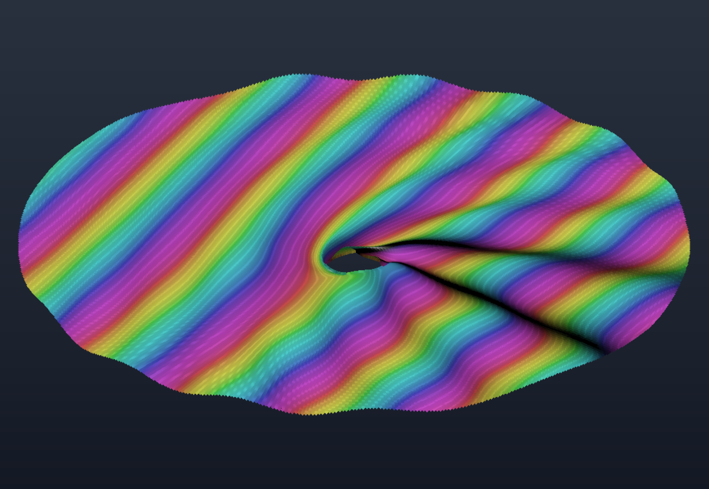
  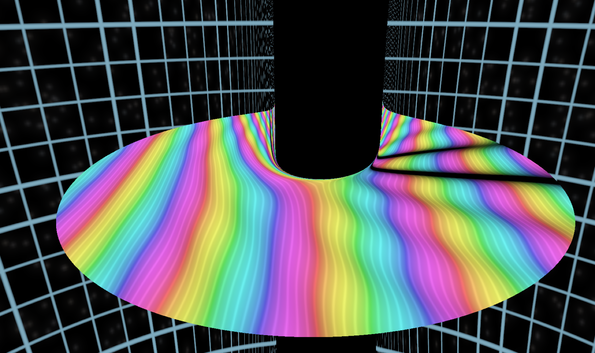
</p>

A la izquierda, el campo complejo Ψ con domain coloring (matiz = arg Ψ, luminancia = |Ψ|) sobre la geometría 3D, A=1.00, B=0.70, ω=1.60, M=20, generado por `app_field.py`. A la derecha, el visor unificado. Esta segunda atribución no la confirmé contra el código que guarda el archivo, solo por el nombre, así que revísalo antes de ponerlo en algo formal.

**Identificabilidad, canal superradiante**

<p align="center">
  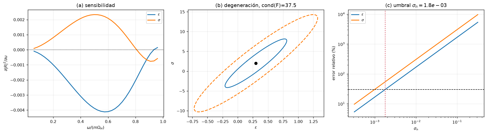
</p>

De izquierda a derecha: dónde vive la información espectral (sensibilidad ∂|R|²/∂u contra ω/mΩ_H), la elipse de degeneración en el plano (eps, sigma), y cómo se pierde identificabilidad con el ruido asumido. Todo sale de `experiments/fisher_analysis.py`.

<p align="center">
  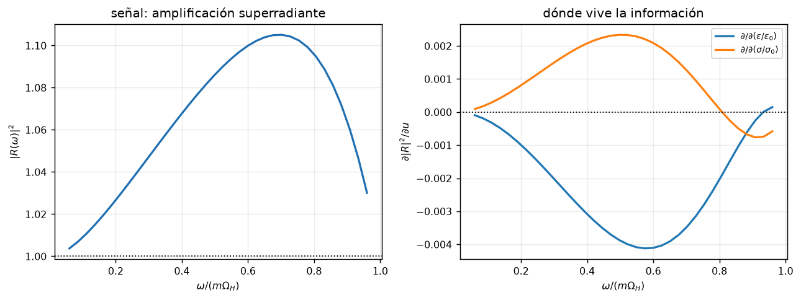
  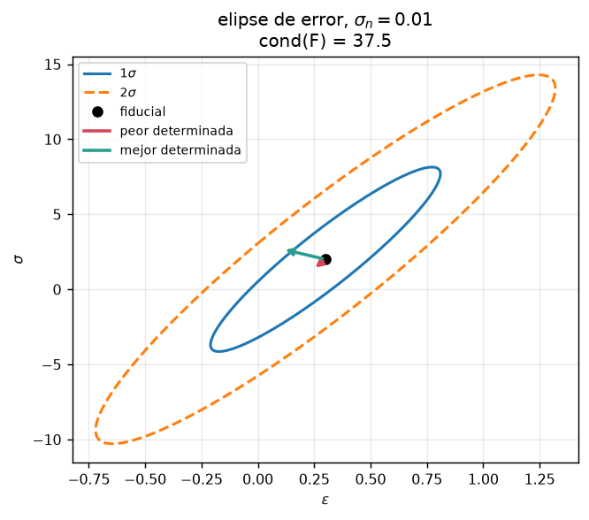
</p>

<p align="center">
  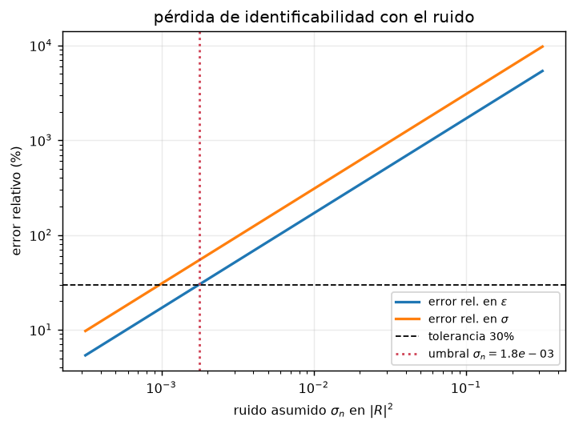
</p>

**Verosimilitud real vs. Fisher**

<p align="center">
  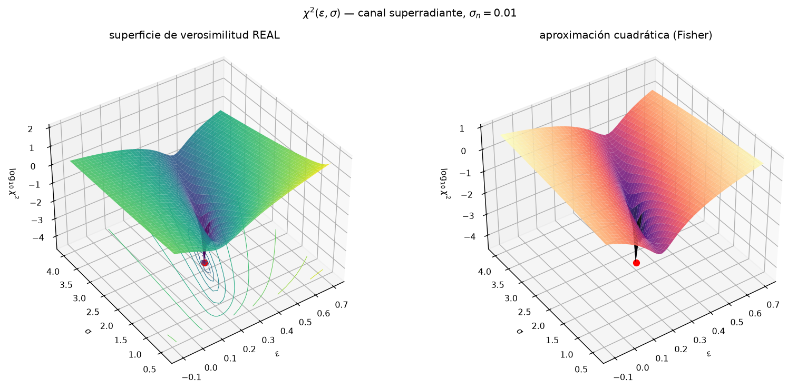
</p>

Superficie χ²(eps, sigma) calculada directo en malla contra la aproximación cuadrática de Fisher. Sale de `experiments/chi2_surface_3d.py`.

<p align="center">
  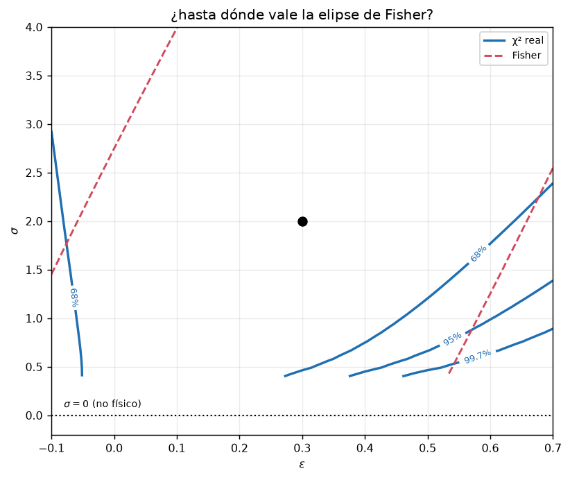
  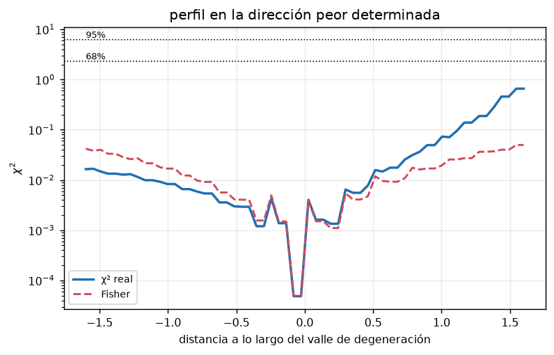
</p>

**Búsqueda de QNM**

<p align="center">
  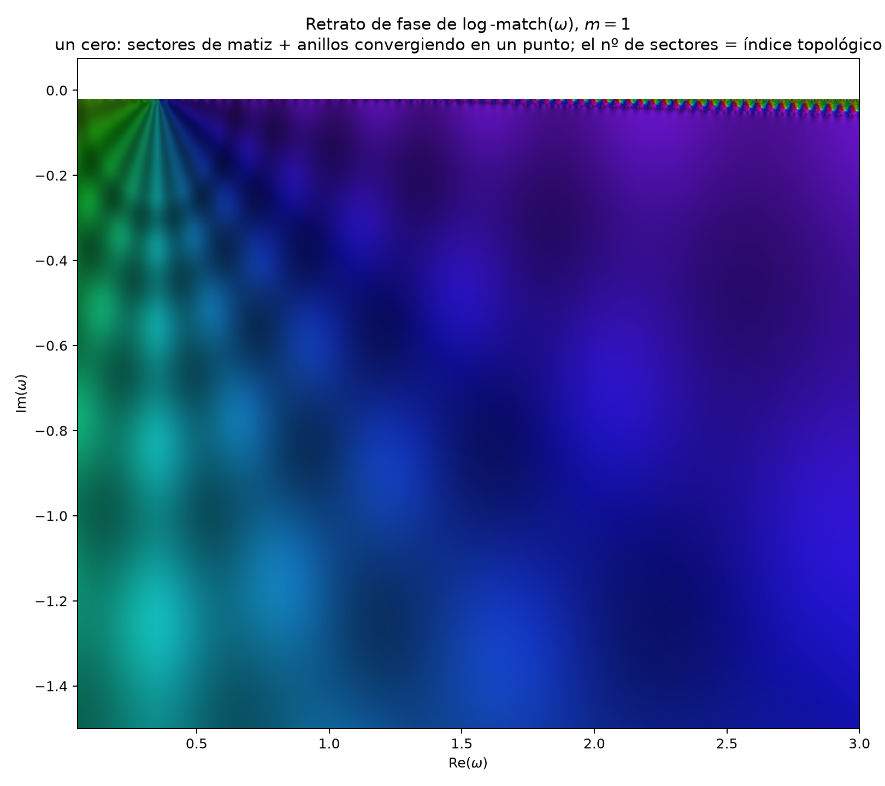
  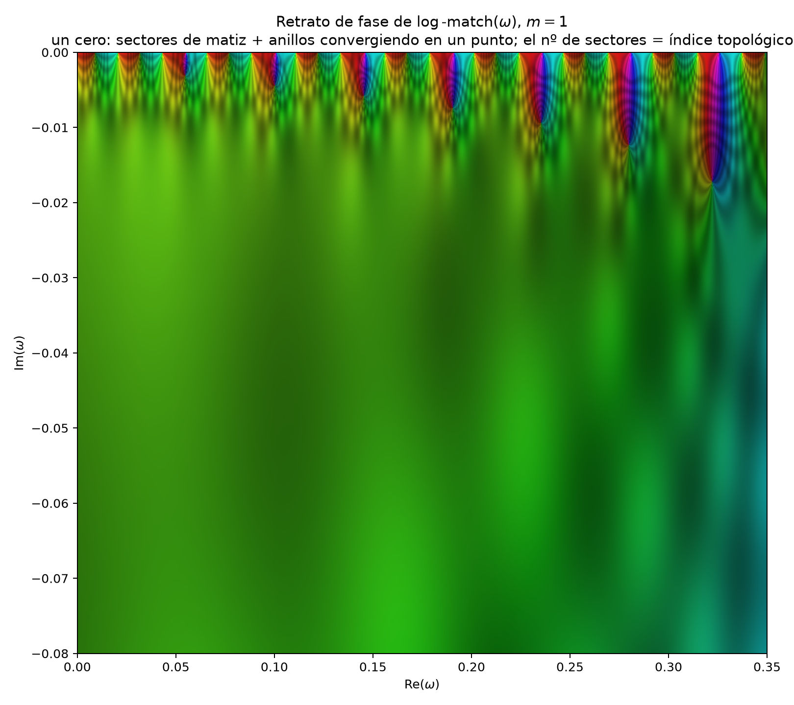
</p>

Retrato de fase de log_match(ω) para m=1, con zoom cerca de ω=0. De `experiments/hunt_qnm.py`.

**Ray tracing acústico**

<p align="center">
  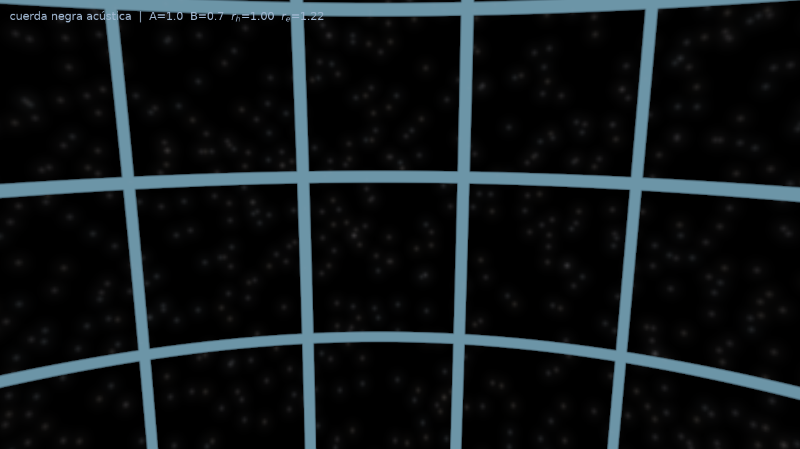
</p>

Sombra del horizonte sobre fondo estelar, trazado con el kernel CUDA de `cuda_kernel.py`, corrido desde `experiments/acoustic_raytracer.py`.

## Instalación

```bash
git clone <url-del-repo>
cd <carpeta-del-proyecto>
python -m venv .venv && source .venv/bin/activate    # Windows: .venv\Scripts\activate
pip install -r requirements.txt
```

CuPy es opcional (`pip install cupy-cuda12x`). Sin GPU, `ScatteringField` cae a scipy solo y los scripts que dependen del kernel lo avisan.

## Uso mínimo

```python
from src.physics.background import DrainingBathtub
from src.physics.deformation import GaussianDeformation
from src.numerics.radial import integrate_radial

bg = DrainingBathtub(A=1.0, B=0.7, c=1.0)
defo = GaussianDeformation(r_h=bg.r_h, eps=0.30, sigma=2.0)

res = integrate_radial(omega=0.6, m=1, bg=bg, defo=defo)
print(res.reflectivity)   # > 1 dentro de la banda superradiante
```

Validar el kernel CUDA antes de usarlo:

```bash
python check_cuda_field.py
```

Reproducir el análisis de Fisher y las figuras del póster:

```bash
python src/experiments/fisher_analysis.py
python src/experiments/chi2_surface_3d.py
```

## Estructura

```
src/
  physics/       background.py (DrainingBathtub), deformation.py (familias h(r))
  mathematics/   potential.py (V_effective, reducción a forma de Schrödinger)
  numerics/      radial.py (problema directo, scipy), qnm.py (modos cuasinormales)
  field/         scattering.py (campo Psi por ondas parciales), coloring.py,
                 analysis.py (test de simetría, convergencia en M, ceros de fase),
                 cuda_radial.py, chi2_cuda.py (kernels CUDA + validate_against_scipy)
  experiments/   render_vortex.py, fisher_analysis.py, chi2_surface_3d.py,
                 acoustic_raytracer.py, hunt_qnm.py, cuda_kernel.py
  viz/           mesh.py, visualizer.py
app_field.py, animate_vortex.py, check_cuda_field.py, field_legend.py,
interactive_viewer.py, viewer_unified.py
```

## Convenciones

Todo usa velocidad del sonido c explícita, no fijada a 1. Parámetros del fondo: A (drenaje), B (circulación), r_h = A/c, r_e = √(A²+B²)/c, Ω_H = Bc²/A². Hay dos convenciones de gravedad superficial en `background.py` y están diferenciadas a propósito: `surface_gravity` (c²/A, [T⁻¹]) y `surface_gravity_visser` (c³/A, aceleración). Al reportar una temperatura de Hawking análoga hay que decir cuál se está usando, si no el número no significa nada.

## Referencias

W. G. Unruh, *Experimental black-hole evaporation?*, Phys. Rev. Lett. 46, 1351 (1981).

M. Visser, *Acoustic black holes: horizons, ergospheres, and Hawking radiation*, Class. Quantum Grav. 15, 1767 (1998).

C. Barceló, S. Liberati, M. Visser, *Analogue gravity*, Living Rev. Relativ. 14, 3 (2011).

R. A. Basak, P. Majumdar, *"Superresonance" from a rotating acoustic black hole*, Class. Quantum Grav. 20, 3907 (2003). Sin verificar, confirmar volumen y página antes de citarlo en el paper.

E. Berti, V. Cardoso, J. P. S. Lemos, *Quasinormal modes and classical wave propagation in analogue black holes*, Phys. Rev. D 70, 124006 (2004). Es la reducción estándar del draining bathtub que `mathematics/potential.py` reproduce como caso h=0.

V. Cardoso, J. P. S. Lemos, S. Yoshida, *Quasinormal modes and stability of the rotating acoustic black hole: numerical analysis*, Phys. Rev. D 70, 124032 (2004).

C. A. R. Herdeiro, N. M. Santos, Phys. Rev. D 99, 084029 (2019).

K. Lu, L. Chen, X. Ge, Acta Phys. Sin. 74, 20250582 (2025).

H.-P. Nollert, *About the significance of quasinormal modes of black holes*, Phys. Rev. D 53, 4397 (1996). J. L. Jaramillo, R. Panosso Macedo, L. Al Sheikh, *Pseudospectrum and black hole quasinormal mode instability*, Phys. Rev. X 11, 031003 (2021). Es la inestabilidad pseudoespectral de los QNM que motiva el método de disparo con acople en `qnm.py`.

S. H. Völkel, K. D. Kokkotas, *Ultra compact stars: reconstructing the perturbation potential*, Class. Quantum Grav. 34, 175015 (2017). *Wormhole potentials and throats from quasi-normal modes*, Class. Quantum Grav. 35, 105018 (2018). Problema espectral inverso en relatividad general.

T. Torres, S. Patrick, A. Coutant, M. Richartz, E. W. Tedford, S. Weinfurtner, *Observation of superradiance in a vortex flow*, Nat. Phys. 13, 833 (2017). Superradiancia medida en agua.

## Contexto

Trabajo hecho en el marco de GISAAT (GeoAI & Teledetección Aplicada).

## Licencia

MIT. Ver `LICENSE`.